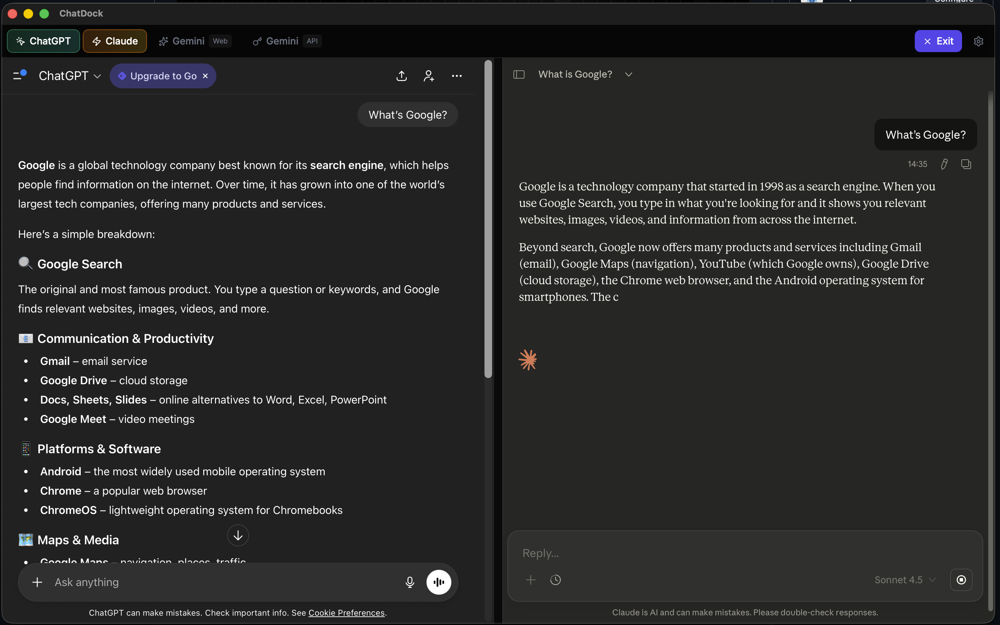
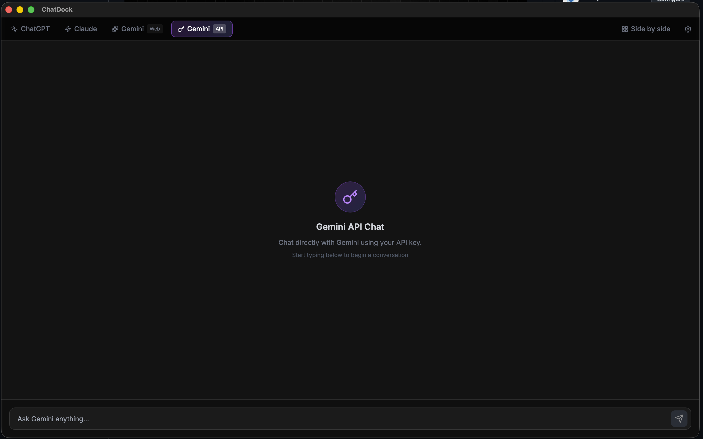
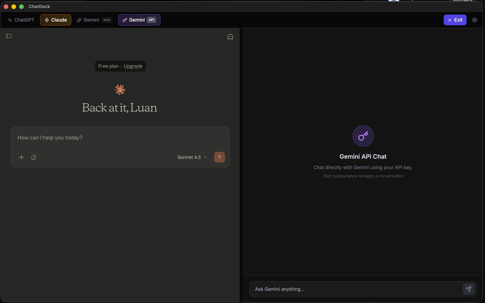

# ChatDock

<div align="center">
  
  <br />
  <br />

  [](LICENSE)
  [](https://tauri.app/)
  [](https://reactjs.org/)
  [](https://www.typescriptlang.org/)
</div>

<div align="center">
  <h3>The All-in-One AI Desktop Workspace</h3>
  <p>Seamlessly access and compare ChatGPT, Claude, and Gemini in a single, unified interface.</p>
</div>

---

## 🚀 Features

- **Unified Interface**: Access multiple AI models (ChatGPT, Claude, Gemini) without tab switching.
- **Compare Mode**: Run prompts in parallel across different models to compare responses side-by-side.
- **Privacy First**: Built with [Tauri](https://tauri.app/), your data stays local.
- **Modern UI**: specialized dark mode design with glassmorphism effects for a premium desktop experience.

## Screenshots

<div align="center">
  
  <p><em>Unified Interface</em></p>
  <br />

  
  <p><em>Side-by-Side Comparison</em></p>
  <br />

  
  <p><em>ChatGPT Integration</em></p>
</div>

## 🛠 Tech Stack

- **Core**: [Rust](https://www.rust-lang.org/) & [Tauri v2](https://tauri.app/)
- **Frontend**: [React v19](https://react.dev/), [TypeScript](https://www.typescriptlang.org/)
- **Build Tool**: [Vite](https://vitejs.dev/)
- **Styling**: Tailwind CSS & Lucide Icons

## 🏁 Getting Started

### Prerequisites

Ensure you have the following installed:
- **Node.js** (v18 or later)
- **Rust** (stable) & Cargo ([Installation Guide](https://www.rust-lang.org/tools/install))
- **pnpm** (recommended) or npm

### Installation

1. **Clone the repository**
   ```bash
   git clone https://github.com/yourusername/chatdock.git
   cd chatdock
   ```

2. **Install dependencies**
   ```bash
   npm install
   ```

3. **Start the development server**
   ```bash
   npm run tauri:dev
   ```

## 📦 Building for Production

To create a standalone executable for your OS (macOS, Windows, or Linux):

```bash
npm run tauri:build
```
The output binary will be located in `src-tauri/target/release/bundle/`.

## 🤝 Contributing

Contributions are welcome! Please feel free to submit a Pull Request.

1. Fork the Project
2. Create your Feature Branch (`git checkout -b feature/AmazingFeature`)
3. Commit your Changes (`git commit -m 'Add some AmazingFeature'`)
4. Push to the Branch (`git push origin feature/AmazingFeature`)
5. Open a Pull Request

## 📄 License

Distributed under the MIT License. See `LICENSE` for more information.
